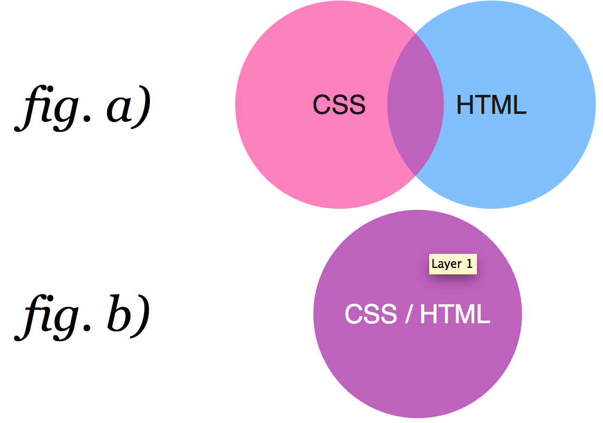
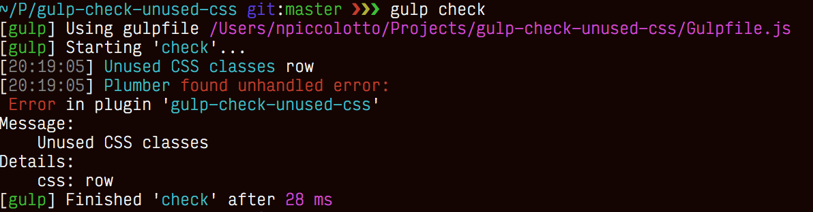

# gulp-check-unused-css

This tool ensures that all of your defined CSS classes are used in your HTML files, and vice versa. If your HTML uses any classes that you have not defined in your CSS files, or if there are css definitions that aren't being used, they will be reported.

This allows for removal of unused and redundant code which will both improve the readability of your project while also slightly reducing file size (and therefore the amount of data being transferred on load).

Going forward I would like to collaborate openly with any open source developers interested in improving this tool, and discuss features that they think are missing for their own particular use case. Please create issues to get the conversation started! :)

## Why gulp-check-unused-css

Consider this Venn diagram:

Figure a) represents what you have now. Some classes are defined in your CSS, but never used in the templates. Some classes used in the templates don't appear in your CSS.

Figure b) represents what you actually want. Keeping your CSS and HTML clean improves the maintainability of your code. You don't want to send useless bytes to your users, because you want site loading to be as fast as possible.

``gulp-check-unused-css`` aims to check for the not-overlapping parts of figure a) and throw an error if it encounters them.

## Installation

    npm install --save-dev gulp-check-unused-css

## Upgrading

If you are upgrading from ``0.0.x``, you should really, REALLY read the docs again. Things that have changed since this plugin's original release:

* How you put HTML files in the plugin
* What this plugin actually checks
* When the plugin throws errors
* How to prevent those errors from breaking your build
* Inverted meaning of ``angular`` option (now off by default)

I didn't publish the two ``1.x.y`` versions, so no worries there.

## Usage

Simple use:

    var checkCSS = require( 'gulp-check-unused-css' );
    gulp
        .src([ 'styles/*.css', 'templates/*.html' ])
        .pipe( checkCSS() );

For advanced use with ``gulp-watch`` check out the [Gulpfile](Gulpfile.js).

Depending on the gulp version, you may have to return the gulp command like below:

    var checkCSS = require( 'gulp-check-unused-css' );
    return gulp
        .src([ 'styles/*.css', 'templates/*.html' ])
        .pipe( checkCSS() );

The plugin will emit all files you put in, because it has to read all of them before checking. Occasionally, however, it will break your pipe. This is good for automated build processes, e.g. in CI systems like Jenkins or Travis.

## Options

* ``ignore``: Array containing strings and/or regexes, if an unused class matches one of it, it is ignored.
* ``globals``: Array of strings identifying predefined sets of ignored classes.
* ``angular``: Boolean, passing ``true`` will turn the support for ``ng-class`` on.

## Ignoring Classes

This plugin is inspired by the [workflow at Github](http://markdotto.com/2014/07/23/githubs-css/#linting), where a build fails if the classes used in the CSS and the templates do not overlap exactly. However, most of us do not write 100% of the CSS ourselves but rely on frameworks such as Bootstrap. That's why there are some options available to ignore "global" or "vendor" classes.

You can provide a list of class names or regular expressions that should be ignored.

    gulp
        .src( 'app.*' )
        .pipe( checkCSS({
            ignore: [ 'special-js-class', /^vendor-/ ]
        }));

Since 1.1.0 you can also add ``globals: [ '{framework}@{version}' ]`` to your options.

    gulp
        .src( 'app.*' )
        .pipe( checkCSS({
            globals: [ 'bootstrap@3.2.0' ]
        }));

And since 2.1.1, you can add your own globals. A "global" is only an array of strings or regexes, so you can do it like this:

    gulp
        .src( 'app.*' )
        .pipe( checkCSS({
            globals: [ [ 'ignore', /^custom-/ ] ]
        }));

Or you can define a module that exports this array and require it:

    // custom-global.js
    module.exports = [ 'ignore', /^custom-/ ];

    // Gulpfile
    gulp
        .src( 'app.*' )
        .pipe( checkCSS({
            globals: [ require( './custom-global' ) ]
        }));

This way you could also automatically create your custom global.

### Globals that Work out of the Box

* Bootstrap 3.2.0 (``bootstrap@3.2.0``)

## Development

    git clone gulp-check-unused-css
    cd gulp-check-unused-css
    npm install
    # hack hack hack
    npm test

### Add a Global to the Project's Source

0. Fork the project
1. Acquire CSS file
2. ``cd gulp-check-unused-css``
3. ``node util/extract.js --file { path to CSS file }``
4. Now there is a ``.ignore`` file (which is actually a CommonJS module) next to the file
5. Rename it appropriately to ``{framework}@{version}.js``
6. Save it to ``src/global``
7. Commit and submit a Pull Request

## Changelog

* ``2.1.1``: Support for custom globals
* ``2.0.1``: Fix main file for npm
* ``2.0.0``: Check HTML files, other breaking changes. See [Upgrading](#upgrading)
* ``1.1.0``: Add support for frameworks
* ``1.0.0``: Join ``ignoreClassNames`` and ``ignoreClassPatterns`` to ``ignore``
* ``0.0.8``: Add support for AngularJS syntax
* ``0.0.7``: I don't remember
* ``0.0.6``: Add check for empty or invalid CSS files
* ``0.0.5``: Fix bug where media queries in the CSS broke everything
* ``0.0.4``: Fix bug where those options could not be used together
* ``0.0.3``: Introduce ``ignoreClassNames``, ``ignoreClassPatterns``

##Contributions/TODO List
This project was recently revived and is actively and enthusiastically seeking contributors. Here's the plan for its next development phase:
- Improve code documentation
- Update dependencies and gulp tasks
- Add support for LESS/Sass
- ~~Add code coverage~~ (Done)
- Add project wiki

To get involved, just file a PR or ask for more information via Issues.

##License
Copyright 2014 Zalando SE

Licensed under the Apache License, Version 2.0 (the "License"); you may not use this file except in compliance with the License. You may obtain a copy of the License at

http://www.apache.org/licenses/LICENSE-2.0

Unless required by applicable law or agreed to in writing, software distributed under the License is distributed on an "AS IS" BASIS, WITHOUT WARRANTIES OR CONDITIONS OF ANY KIND, either express or implied. See the License for the specific language governing permissions and limitations under the License.
